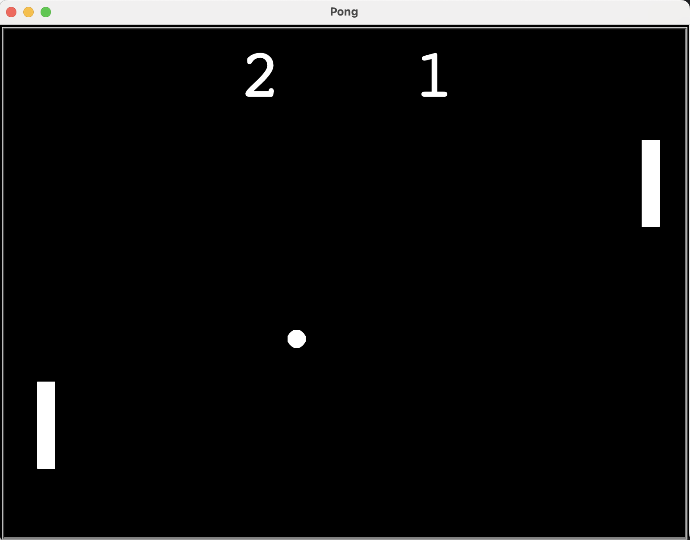

# Pong Game (Python – Turtle Graphics)

This project was built to practice OOP, real-time input handling, collision detection, and modular game design in Python, while recreating the classic arcade game - **Pong game** - using the `turtle` graphics module.  

---

## Game Features
- Two-player local gameplay
- Smooth paddle and ball movement
- Collision detection (walls & paddles)
- Increasing difficulty as the ball speeds up
- Live score tracking
- Modular, object-oriented design

---

## Technical Concepts 
- Object-Oriented Programming (OOP)
- Python modules & file separation
- Turtle graphics
- Event listeners & keyboard controls
- Game loops
- Collision detection
- State management

---

## Output Preview


---

## Controls
| Player | Move Up | Move Down |
|------|--------|----------|
| Left Paddle | `W` | `S` |
| Right Paddle | `↑` | `↓` |

---

## How to Run

1. Clone this repository:
   ```bash
   git clone https://github.com/MichelleRunning/pong-game.git
   cd pong-game
   ```

3. Run the game:
   ```bash
   python main.py
   ```
4. Use the controls table above to play.


